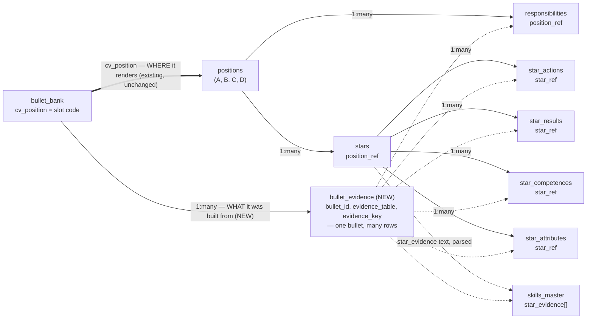

---

## 1. What is the problem or opportunity?

`[[Fix CV Bullet Evidence Linking in the Career Graph]]` (CI-040, delivered 2026-08-06) fixed a real bug —
CV Bullets were checking `cvPosition` against a position *title* instead of a `CV_SLOTS` slot code, so the
match had never once succeeded. The fix (`CV_SLOT_STAR_REF`, a hardcoded slot→STAR map) made every bullet
link to something real: a project-slot bullet (A1, B2, ...) now draws a dashed line to the STAR that owns
that slot; a role-overview bullet (A0, B0, ...) draws to its position's Responsibilities.

**That fix answers the wrong question at the wrong granularity.** `CV_SLOT_STAR_REF` answers "which STAR
does slot A1 belong to" — a per-*slot* inference, good enough to stop bullets linking to nothing, but not
what the graph actually needs to show. The real, useful question is per-*bullet*: which exact evidence row
— a specific `star_action`, `star_result`, `responsibility`, `star_competence`, `star_attribute`, or
`skills_master` entry — was *this* bullet actually written from? Right now every bullet filed under A1
draws to the *same* STAR node, regardless of which specific action or result it was really built from — the
graph can't tell the difference because `bullet_bank` has never recorded where a bullet's text actually came
from. This is the difference between "the graph is honest about what it can show" (CI-040, delivered) and
"the graph shows the right thing" (this CI, not yet started).

This is also the foundation `[[Adjustment of Career Graph as Evidence Picker]]` needs: a picker that lets
someone see and swap the exact evidence backing a CV line requires that link to exist as real data, not be
inferred from which slot the bullet happens to render in.

**Confirmed empirically, not assumed**: a bullet is not always built from exactly one evidence row. Checked
the owner's real `bullet_bank` against every `star_action`/`star_result`/`responsibility`/`star_competence`/
`star_attribute`/`skills_master` row via a shared-phrase heuristic (not a claim of proof, just a signal).
Most bullets have one dominant match, but several look like genuine merges — clearest is `C1`:

> "Designed and implemented an Accounting Correction Layer using a segregated Postgres staging scheme and
> sequenced queries..."

— which scores almost equally against **three separate** `star_actions`: mapping the As-Is process
(`3-1`), building the Postgres staging schema (`3-2`), and sequencing the correction queries (`3-4`). It
reads as one narrative bullet stitched together from three pieces of evidence, not a rewrite of one. `C6`,
`P2`, and `S4` show the same pattern less starkly. **A single evidence pointer per bullet will not be
enough — this needs a real one-to-many relationship, not two flat columns on `bullet_bank`.**

## 2. What would the improvement look like?

Not fully scoped — this is a handoff to a fresh session, not a plan to execute here. What's already decided
and shouldn't need re-litigating:

### 2.1 Schema: a junction table, not flat columns

The owner's original proposal was two new columns directly on `bullet_bank` — `bullet_evidence_table` /
`bullet_evidence_key` (a polymorphic pointer, same shape `requirementTailoring.evidenceKind`/`evidenceRef`
already uses one level downstream, in the tailoring pipeline). The §1 finding means that should become a
**separate table**, one row per (bullet, evidence) pair — the same "many-to-many by design" pattern
`requirement_evidence` already uses elsewhere in this schema (`docs/DATA_MODEL.md`: "one requirement is
routinely carried by several bullets"). Proposed shape, not final:

```ts
export const bulletEvidence = pgTable('bullet_evidence', {
  ...base,
  bulletId: uuid('bullet_id').notNull(),       // -> bullet_bank.id
  evidenceTable: text('evidence_table'),        // 'responsibilities' | 'stars' | 'star_actions' |
                                                 // 'star_results' | 'star_competences' |
                                                 // 'star_attributes' | 'skills_master'
  evidenceKey: text('evidence_key'),            // the ref_code within that table
});
```

This is deliberately additive — it does not replace `bulletBank.cvPosition`/`CV_SLOTS`, which answers a
different question (**where** a bullet renders on the CV) from `bullet_evidence` (**what** it was built
from). Both stay; neither implies the other.

### 2.2 Backfill — the real work, and a judgment call on how

~27 real bullets need their actual evidence source(s) determined. Two ways to do this, not decided:

- **Manual** — the owner reviews each bullet against its candidate evidence rows and confirms.
- **LLM-assisted proposal, human-confirmed** — a script in the shape of the existing
  `scripts/propose-skill-star-links.ts` (ranks candidates, prints matched terms, writes nothing without
  `--apply`, never auto-applies a low-confidence guess) could rank each bullet's most likely evidence
  row(s) using the same real data this CI's own investigation script used, but a human still confirms —
  this is provenance data, not a best-effort inference the graph should render on faith.

Whichever path, the §1 heuristic script (see §3) is a reasonable starting point for candidate ranking, not
a finished answer — it's a shared-phrase heatmap, not semantic understanding, and multi-source bullets
especially need a human eye (a bullet with three roughly-equal-scoring candidates is a genuine merge, but
so is a bullet with three roughly-equal *wrong* candidates the heuristic couldn't distinguish).

### 2.3 Rewire the Career Graph

`lib/career-graph-view-model.ts`'s bullets loop currently draws `bullet-slot` links via `CV_SLOT_STAR_REF`/
`CV_SLOT_LETTER_POSITION` (CI-040). Once `bullet_evidence` exists and is populated, the graph should draw
its dashed evidence lines from the real per-bullet rows instead — to the exact action/result/responsibility/
competence/attribute/skill each bullet actually cites, not the slot's inferred STAR. Whether `CV_SLOT_
STAR_REF` stays (it may still be useful as a fallback for any bullet with no confirmed `bullet_evidence` row
yet — "no confirmed source" is a more honest graph state than "wrong source," so decide the fallback
behavior deliberately, not by default) is an open design question for whoever picks this up.

### 2.4 The data model, illustrated

The owner's own hand-drawn diagram named the relationships this CI is built on; the diagram below is the
same model, redrawn to show where the new piece (`bullet_evidence`, dashed) sits relative to what already
exists (solid):



The thick `==>` edge is the relationship CI-040 already wired correctly (a bullet's CV_SLOTS placement).
The `bullet_evidence` node and its dashed edges are what this CI adds — note it can point at *any* of the
six evidence kinds, and a real bullet (§1) can need more than one such edge.

## 3. Resources or references

- `[[Fix CV Bullet Evidence Linking in the Career Graph]]` — CI-040, the slot-level fix this supersedes in
  spirit but not in fact (both relationships are real and both stay).
- `[[Adjustment of Career Graph as Evidence Picker]]` — the feature this data actually serves; a picker
  needs real per-bullet provenance to select/swap evidence against, not a slot-level inference.
- `lib/career-graph-view-model.ts` — the bullets loop to rewire once `bullet_evidence` exists.
- `lib/db/schema.ts` — `requirement_evidence` for the existing many-to-many precedent; `bullet_bank` is
  where `bullet_evidence` would attach.
- `scripts/propose-skill-star-links.ts` — the shape a human-confirmed proposal script should follow if that
  path is chosen for the backfill.
- `docs/DATA_MODEL.md` — the "many-to-many by design" rationale already written down for
  `requirement_evidence`; the same logic applies here.

## 4. Notes / Progress log

### 2026-08-07 · Opened as a handoff

Surfaced when the owner, reviewing CI-040 and CI-039 after both were marked Delivered, produced a hand-drawn
data-model diagram of the Career Graph and asked directly whether the current CV Bullet visualization was
adequate. It isn't — CI-040 fixed a real bug but at the slot level, not the bullet level. The owner's own
proposed `bullet_evidence_table`/`bullet_evidence_key` columns were checked against real data before being
written up here: confirmed the underlying idea is right, but the shape needs to be a one-to-many junction
table, not two flat columns, because real bullets (at least `C1`, and less starkly `C6`/`P2`/`S4`) appear
built from more than one evidence row. Deliberately not implemented in the session that opened this CI —
handed off fresh to preserve context budget for the actual schema/backfill/rewiring work.

**Model recommendation for the implementing session**: mixed. The schema migration and the
`career-graph-view-model.ts` rewiring are mechanical, well-specified changes — **Sonnet 5** is the right
tier for those, same as CI-040 and CI-039 both used throughout. The backfill (§2.2) is the part that
actually needs judgment: distinguishing "this bullet merges three evidence rows" from "this bullet loosely
echoes three rows but was really written from one" is exactly the kind of nuanced, stakes-bearing call
Truthfulness-critical work in this codebase already reserves for **Opus** (same tier C5's profile-writing
step uses, per its own comment: "Truthfulness-critical (Master Instructions §6.1) → Opus tier") — this is
provenance data a future Evidence Picker will treat as ground truth, so a wrong confident guess here is
worse than a flagged uncertain one. If the backfill goes the LLM-assisted-proposal route (§2.2), the
proposal-ranking step should run on Opus even if the surrounding script logic doesn't need it.
