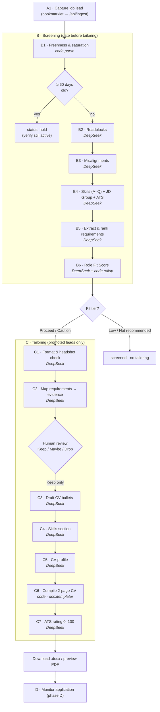

# Pipeline — A → B → C → CI → D

The domain process, mapped to implementation. Each step's authoritative spec is its note in
[`Process/`](../Process/); this document is the index that ties those notes to code modules,
models, and I/O contracts. **The `Process/*.md` notes ARE the prompt templates** — load them at
runtime, don't rewrite them.

## Flow



## A — Acquire

| Step | Note | Model | Input → Output |
| --- | --- | --- | --- |
| **A1** Store job lead | `A1. Store Job Leads.md` | — (capture) | LinkedIn URL/JD → `job_leads(status=captured)` + raw markdown in Storage |

## B — Screen

All B steps read the captured JD; outputs land on `job_leads` / `job_requirements`.

| Step | Note | Model | Output (tool schema) |
| --- | --- | --- | --- |
| **B1** Freshness & saturation | `B1. Capture Posting Freshness and Market Saturation.md` | **code** | days_since_publication, applicant_count, freshness/saturation bands. **Gate:** ≥60 days → `hold`. |
| **B2** Roadblocks | `B2. Identify Roadblocks.md` | DeepSeek | hard ineligibility across {language, technical, certification, geographic, industry} or `None` |
| **B3** Misalignments | `B3. Identify Misalignments.md` | DeepSeek | flags (not blockers) across {values/culture, city, seniority}. Context: `Values & Motives Summary.md` |
| **B4** Skills + JD Group + ATS | `B4. Translate Requirements to Areas of Expertise and Define JD Groups.md` | DeepSeek | 17 ratings (A–Q, 1/2/3), `jd_group_primary/secondary`, detected `ats_system`, tailoring notes |
| **B5** Extract requirements | `B5. Extract Requirements from Job Description.md` | DeepSeek | `job_requirements[]`: order, rank (Core/Important/Nice), requirement, description, skills |
| **B6** Role Fit & Investment Worthiness Score | `B6. Role Fit & Investment Worthiness Score.md` | **DeepSeek + code** | per-dimension scores + per-requirement match/score → **code computes overall + tier** |

### B6 scoring (computed in `lib/scoring`, not by the LLM)

```
overall = 0.35·relevance + 0.20·seniority + 0.20·impact + 0.15·reqAlign + 0.10·ats
reqAlign = Σ(reqScore · weight) / Σ(weight),  weight = {Core:3, Important:2, Nice:1}
```

Match strength must stay consistent with the score band (Excellent 9–10 … No Match 0–1). Record
the `bullet_bank_version` used. Recommendation tier (Proceed / Caution / Low / Not recommended)
comes from code-owned thresholds. **B6 reads the Master Bullet Bank, not a tailored CV** — this
keeps scoring unbiased and reproducible.

## C — Tailor (only promoted leads)

| Step | Note | Model | Output |
| --- | --- | --- | --- |
| **C1** Format & compliance | `C1. Overall Application Content and Format Guidance.md` | DeepSeek | CV format/length, cover-letter required?, **headshot decision** (country/DEI tree), HR contact |
| **C2** Map requirements → evidence | `C2. Map JD Requirements to Supporting Evidence.md` | DeepSeek | `requirement_tailoring[]`: evidence `ref_code`, original_text, `cv_position` → **`approval_status=pending`** |
| ⟶ **Human gate** | — | — | Each link marked **Keep / Maybe / Drop**. Only **Keep** proceeds. One evidence piece → one requirement (dedup by specificity). |
| **C3** Evidence → CV bullets | `C3. Transform Evidence into CV Bullets.md` | DeepSeek | `cv_bullet` per Keep row (7 principles: truthful, natural keywords, strong verbs, real metrics, skill tags, concise) |
| **C4** Skills section | `C4. Build and Manage the Skills Section.md` | DeepSeek | 3–5 categories ×4–8 skills; every bullet-referenced skill must appear here |
| **C5** CV profile | `C5. Drafting CV Profile (Per Job Lead).md` | DeepSeek | 4–7 line profile leading with seniority + core-requirement alignment |
| **C6** Compile CV | `C6. Compile Complete CV Document.md` | **code** | `docxtemplater` fills the 2-page template; space rules enforced as a content budget |
| **C7** ATS rating | `C7. Run Reviewed ATS Matching Rating.md` *(status: dev)* | DeepSeek | 0–100 rating + per-requirement breakdown |

## CI — Continuous Improvement

| Artifact | Note |
| --- | --- |
| Procedure | `+ Continuous Improvement Procedure.md` |
| Dashboard method (folded into RoleProof surfaces) | `+ Continuous Improvement Dashboard.md` |
| ~10 initiatives | `Process/CI/*.md` |

Any session can raise an **Accuracy Improvement Tip** (Feedback Loop / Profile Update / Data
Capture / Process Refinement). In the app these become `ci_initiatives` rows. The loop is what
makes the system compound: a tip → a `Process/*.md` edit → new agent behavior, no code change.

## D — Monitor (early / development)

| Step | Note | State |
| --- | --- | --- |
| **A0** Monitor target companies | `Process/Development/A0. Monitoring Target Companies.md` | idea |
| **D1** Monitor applications | `Process/Development/D1. Monitoring Applications.md` | idea |

---

*Implementation lives in `lib/pipeline/*` (one module per step) and `lib/scoring/*` (the
deterministic rollups). See [`ARCHITECTURE.md`](ARCHITECTURE.md).*
