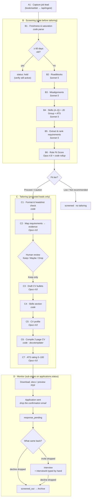

# Pipeline — A → B → C → CI → D

The domain process, mapped to implementation. Each step's authoritative spec is its note in
[`Process/`](../Process/); this document is the index that ties those notes to code modules,
models, and I/O contracts. **The `Process/*.md` notes ARE the prompt templates** — load them at
runtime, don't rewrite them.

## Flow


```mermaid
flowchart TD
    A1["A1 · Capture job lead<br/>(bookmarklet → /api/ingest)"] --> B1

    subgraph B["B · Screening (gate before tailoring)"]
        B1["B1 · Freshness & saturation<br/><i>code parse</i>"] --> G1{"≥ 60 days<br/>old?"}
        G1 -- yes --> HOLD["status: hold<br/>(verify still active)"]
        G1 -- no --> B2["B2 · Roadblocks<br/><i>Sonnet 5</i>"]
        B2 --> B3["B3 · Misalignments<br/><i>Sonnet 5</i>"]
        B3 --> B4["B4 · Skills (A–Q) + JD Group + ATS<br/><i>Sonnet 5</i>"]
        B4 --> B5["B5 · Extract & rank requirements<br/><i>Sonnet 5</i>"]
        B5 --> B6["B6 · Role Fit Score<br/><i>Opus 4.8 + code rollup</i>"]
    end

    B6 --> G2{"Fit tier?"}
    G2 -- "Low / Not recommended" --> STOP["screened · no tailoring"]
    G2 -- "Proceed / Caution" --> C1

    subgraph C["C · Tailoring (promoted leads only)"]
        C1["C1 · Format & headshot check<br/><i>code</i>"] --> C2["C2 · Map requirements → evidence<br/><i>Opus 4.8</i>"]
        C2 --> HITL{"Human review<br/>Keep / Maybe / Drop"}
        HITL -- "Keep only" --> C3["C3 · Draft CV bullets<br/><i>Opus 4.8</i>"]
        C3 --> C4["C4 · Skills section<br/><i>code</i>"]
        C4 --> C5["C5 · CV profile<br/><i>Opus 4.8</i>"]
        C5 --> C6["C6 · Compile 2-page CV<br/><i>code · docxtemplater</i>"]
        C6 --> C7["C7 · ATS rating 0–100<br/><i>Opus 4.8</i>"]
    end

    C7 --> DL["Download .docx / preview PDF"]

    subgraph D["D · Monitor (sub-states on applications.status)"]
        DL --> SENT["Application sent<br/><i>drop the confirmation email</i>"]
        SENT --> RP["response_pending"]
        RP --> G3{"What came back?"}
        G3 -- "invite dropped" --> IV["interview<br/>+ interviewAt typed by hand"]
        G3 -- "decline dropped" --> SO["screened_out → Archive"]
        IV -- "decline dropped" --> SO
    end
```

## A — Acquire

| Step | Note | Model | Input → Output |
| --- | --- | --- | --- |
| **A1** Store job lead | `A1. Store Job Leads.md` | — (capture) | LinkedIn URL/JD → `job_leads(status=captured)` + raw markdown in Storage |

## B — Screen

All B steps read the captured JD; outputs land on `job_leads` / `job_requirements`.

**B runs in two halves, not one pass** (`lib/pipeline/screening.ts`). `runInitialChecks` (B1→B2→B3)
fires automatically from `createLead()` at capture; the G1 gate above is a real short-circuit, so a
posting ≥60 days old reaches `hold` with **no B2/B3 rows in `pipeline_runs` at all**. A lead nothing
flagged auto-advances to `selected`; anything flagged parks at `scoring_queue` for a human decision.
`runScoring` (B4→B5→B6) then runs later, once, over the whole `selected` pile from the Ready-to-score
batch runner — deliberately sequential, so the calls land seconds apart and hit the warm 1h prompt
cache. `runScreening` remains as a back-compat wrapper that chains both halves.

| Step | Note | Model | Output (tool schema) |
| --- | --- | --- | --- |
| **B1** Freshness & saturation | `B1. Capture Posting Freshness and Market Saturation.md` | **code** | days_since_publication, applicant_count, freshness/saturation bands. **Gate:** ≥60 days → `hold`. |
| **B2** Roadblocks | `B2. Identify Roadblocks.md` | Sonnet 5 | hard ineligibility across {language, technical, certification, geographic, industry} or `None` |
| **B3** Misalignments | `B3. Identify Misalignments.md` | Sonnet 5 | flags (not blockers) across {values/culture, city, seniority}. Context: `Values & Motives Summary.md` |
| **B4** Skills + JD Group + ATS | `B4. Translate Requirements to Areas of Expertise and Define JD Groups.md` | Sonnet 5 | 17 ratings (A–Q, 1/2/3), `jd_group_primary/secondary`, detected `ats_system`, and the "Key Patterns & CV Tailoring Notes" text (§B step 3 of the note) → `job_leads.key_patterns` |
| **B5** Extract requirements | `B5. Extract Requirements from Job Description.md` | Sonnet 5 | `job_requirements[]`: order, rank (Core/Important/Nice), requirement, description, skills |
| **B6** Role Fit & Investment Worthiness Score | `B6. Role Fit & Investment Worthiness Score.md` | **Opus 4.8 + code** | per-dimension scores + per-requirement match/score → **code computes overall + tier** |

### B6 scoring (computed in `lib/scoring`, not by the LLM)

```
overall = 0.35·relevance + 0.20·seniority + 0.20·impact + 0.15·reqAlign + 0.10·ats
reqAlign = Σ(reqScore · weight) / Σ(weight),  weight = {Core:3, Important:2, Nice:1}
```

Match strength must stay consistent with the score band (Excellent 9–10 … No Match 0–1). Record
the `bullet_bank_version` used. Recommendation tier (Proceed / Caution / Low / Not recommended)
comes from code-owned thresholds. **B6 reads the Master Bullet Bank, not a tailored CV** — this
keeps scoring unbiased and reproducible.

## C — Tailor (only promoted leads)

| Step | Note | Model | Output |
| --- | --- | --- | --- |
| **C1** Format & compliance | `C1. Overall Application Content and Format Guidance.md` | **code** | CV format/length, cover-letter required?, **headshot decision** (country/DEI tree), HR contact |
| **C2** Map requirements → evidence | `C2. Map JD Requirements to Supporting Evidence.md` | Opus 4.8 | `requirement_tailoring[]`: evidence `ref_code`, original_text, `cv_position` → **`approval_status=pending`** |
| ⟶ **Human gate** | — | — | Each link marked **Keep / Maybe / Drop**. Only **Keep** proceeds. One evidence piece → one requirement (dedup by specificity). |
| **C3** Evidence → CV bullets | `C3. Transform Evidence into CV Bullets.md` | Opus 4.8 | `cv_bullet` per Keep row (7 principles: truthful, natural keywords, strong verbs, real metrics, skill tags, concise) + `requirement_skills` (Job-Lead-facing skills this bullet demonstrates — the bracketed tag) |
| **C4** Skills section | `C4. Build and Manage the Skills Section.md` | **code** | 3–5 categories ×4–8 skills, built primarily from Keep rows' `my_skills` (consistency rule, uncapped) + a requirement-overlap top-up across Skills/STAR Competences/STAR Attributes |
| **C5** CV profile | `C5. Drafting CV Profile (Per Job Lead).md` | Opus 4.8 | 4–7 line profile leading with seniority + core-requirement alignment |
| **C6** Compile CV | `C6. Compile Complete CV Document.md` | **code** | `docxtemplater` fills the 2-page template; space rules enforced as a content budget |
| **C7** ATS rating | `C7. Run Reviewed ATS Matching Rating.md` *(status: dev)* | Opus 4.8 | 0–100 rating + per-requirement breakdown |

## CI — Continuous Improvement

| Artifact | Note |
| --- | --- |
| Procedure | `+ Continuous Improvement Procedure.md` |
| Dashboard method (folded into RoleProof surfaces) | `+ Continuous Improvement Dashboard.md` |
| ~10 initiatives | `Process/CI/*.md` |

Any session can raise an **Accuracy Improvement Tip** (Feedback Loop / Profile Update / Data
Capture / Process Refinement). In the app these become `ci_initiatives` rows. The loop is what
makes the system compound: a tip → a `Process/*.md` edit → new agent behavior, no code change.

## D — Monitor

Once a CV goes out, the lead sits at `job_leads.status = 'applied'` and **stays there for the whole
D-phase**. What changes is `applications.status`, a sub-state on the one row per `(owner, lead)`.
That split is deliberate: `job_leads.status` is the field every board consumer keys off, and these
are moments inside "applied", not new lead-level stages.

| `applications.status` | Set by | Surface |
| --- | --- | --- |
| `downloaded` | opening `/api/cv/[leadId]` | — (tracking only) |
| `response_pending` | "Application sent" — a dropped confirmation email, or the no-email manual confirm | Applications |
| `interview` | a dropped interview invite; `interviewAt` is then typed by hand | Applications |
| `screened_out` | a dropped decline | Archive |

```
response_pending ──(invite)──▶ interview ──(decline)──▶ screened_out
        └───────────────(decline)───────────────────────────▶
```

The three transitions are all drag-and-drop: the email is dragged out of Outlook onto the row,
stored under `applications/{leadId}/`, and the link column gets an href to this app's own
owner-scoped copy (`/api/applications/[leadId]/email/[file]`). Nothing is typed except the
interview date, which is a future fact no email carries. A drop with no file or link in it opens a
short manual form instead, pre-filled with today — the gesture works either way.

`screened_out` rows leave the Applications list and appear in the Archive in the same move, with
no confirmation step; the reply-assist pop-up that follows is only a reply assist, and dismissing
it reverts nothing.

Still on the drawing board:

| Step | Note | State |
| --- | --- | --- |
| **A0** Monitor target companies | `Process/Development/A0. Monitoring Target Companies.md` | idea |

---

*Implementation lives in `lib/pipeline/*` (one module per step) and `lib/scoring/*` (the
deterministic rollups). See [`ARCHITECTURE.md`](ARCHITECTURE.md).*
