# Roots Review HTML — Post-Refactor Update Plan

> **Goal:** Merge the refactor-pass review (with strikethrough/comment markup) into the canonical `docs/phases/roots-review.html`, distinguish commit `30308ef` from uncommitted WIP, document remaining gaps, refresh key screenshots, and redirect/archive the duplicate reports.
>
> **Status:** Approved · 30 Jun 2026  
> **Canonical output:** `docs/phases/roots-review.html`

---

## What changed since the original report (30 Jun)

Your work splits across two layers. The HTML update will make this explicit so nothing reads as "done" when it is only local WIP.

```mermaid
flowchart LR
  subgraph baseline [Original roots review]
    A[Mock C2-C7 stubs]
    B[Programmatic DOCX only]
    C[No CI prompt loop]
    D[Cookie-based ingest]
  end
  subgraph commit30308ef [Commit 30308ef]
    E[C2/C3/C5/C7 prompts + runStructured]
    F[docxtemplater on CV_Template.docx]
    G[ciGuidanceFor + recordGapTips]
    H[DeepSeek live path + LIVE/MOCK badge]
    I[Owner-scoped B/C pipeline]
    J[Dynamic-origin bookmarklet at /leads/new]
  end
  subgraph workingTree [Uncommitted WIP]
    K["/roleproof/capture + signed token"]
    L[TraceDisclosure in workspace]
    M[Delete /leads/new]
    N[Monitoring/auth hardening]
  end
  baseline --> commit30308ef --> workingTree
```

### Closed in commit `30308ef` (verified in git)

| Gap from original review | Evidence |
| --- | --- |
| C2–C7 prompts registered | `lib/prompts.ts` — C2/C3/C5/C7 in `STEP_NOTE` |
| C2 LLM over full evidence graph | `lib/pipeline/tailoring.ts` `gatherEvidence()` + `runStructured` C2 |
| C3/C5/C7 live LLM paths | Same file — `runStructured` for C3, C5, C7 |
| Real-template C6 | `lib/docx/template.ts` + `templateSlotData()` Keep-only slots |
| CI tips feed prompts | `lib/ci.ts` `ciGuidanceFor()` appended in `systemPromptFor()` |
| C2 gaps → Profile-Update tips | `recordGapTips()` in tailoring C2 |
| LIVE/MOCK badge | `components/app-header.tsx` |
| DeepSeek provider | `lib/env.ts` + `lib/anthropic/client.ts` |
| Owner-scoped pipeline reads/writes | tailoring/screening pass `effectiveOwnerId`; `recordStep` stamps owner |
| Mark-applied scaffold | `app/actions/monitoring.ts` |
| Capture origin-aware (no localhost hardcode) | `app/leads/new/page.tsx` in commit — `bookmarkletFor(origin)` |

### Closed only in uncommitted working tree (not in `30308ef` yet)

| Item | Evidence |
| --- | --- |
| Signed capture token (fixes bookmarklet attribution) | `app/api/ingest/route.ts` diff — `verifyCaptureToken` |
| Canonical capture route | New `app/roleproof/capture/page.tsx`; `app/leads/new/page.tsx` deleted |
| Workspace run trace (folded audit) | `components/roleproof/workspace.tsx` `TraceDisclosure` (+256 lines vs HEAD) |
| Guided spine demoted | `app/roleproof/leads/[id]/page.tsx` `badge="alternative preview"` |

**HTML markup:** use a distinct `.review-note.wip` badge so you can see "implemented locally, commit when ready."

### Still open (refactor pass did not close these)

**P0 methodology**

- **B3 Values & Motives** — still no loader for `Profile/Values & Motives Summary.md`; B3 user message is JD + city only (`lib/pipeline/screening.ts` ~L76)
- **Live calibration** — `LLM_MODE=mock` default; no golden-lead comparison run documented
- **C7 persistence on reload** — rating lives in `pipeline_runs.output` + client state (`components/roleproof/workspace.tsx` `useState`); not on `job_leads`, not hydrated on SSR

**P1 output fidelity**

- **Template completeness** — C6 fills 11 experience slots only; C4 skills + C5 profile not written into Word output (`lib/docx/template.ts` comment L5–6)
- **C4 categories** — still proficiency buckets, no `skill_category` column
- **CV preview** — no PDF/render check before download

**P1 product/ops**

- **CI dashboard** — `getDashboardData()` + seeded `ci_initiatives` exist (`lib/queries.ts`); no `app/dashboard/page.tsx`, `listCiInitiatives()` unused in UI
- **Outcome UI** — `recordOutcomeAction` in monitoring has no workspace caller
- **A0 target-company monitoring** — not built

**P2 hygiene**

- **Stale screenshots** — current images predate trace UI, capture route, LIVE badge
- **Duplicate outdated HTML** — `docs/roots-review/index.html` still claims C-steps are stubs; must redirect

---

## HTML edit plan (canonical: `docs/phases/roots-review.html`)

Merge content from `docs/reports/current-prototype-roots-report-2026-06-30.html` into the phases copy. Adopt its proven markup patterns.

### CSS additions (from reports file)

- `del` — strikethrough for superseded claims
- `.review-note` variants: `.ok` (done), `.wip` (uncommitted), `.warn` (partial), `.stop` (still missing)
- HTML comments: `<!-- REVIEWER: ... -->` at section tops for audit trail

### Structural changes to `docs/phases/roots-review.html`

1. **Hero** — update date, scorebar, meta pills:
   - Baseline: 30 Jun original review
   - Pass 1: commit `30308ef`
   - Pass 2: uncommitted WIP (if any at edit time)
   - Replace static stats (4 faithful / 5 hollow) with recalculated counts

2. **New section: `#refactor-pass`** — transplant the "Closed / Still needs attention" grids and code-review table from reports file, with corrections:
   - Split "Closed" into **Committed** vs **WIP (uncommitted)**
   - Add row: **Provider shift Anthropic → DeepSeek** (not in original review)
   - Add row: **C7 lost on page reload** (partial, not closed)
   - Fix overclaims: capture token and TraceDisclosure only WIP until committed

3. **Executive verdict** — rewrite using strikethrough pattern:
   - ~~Tailoring core stubbed~~ → C2/C3/C5/C7 wired in commit; calibration + template completeness remain
   - ~~CV programmatic only~~ → real-template path exists; profile/skills not inserted
   - ~~CI loop dormant~~ → tips now feed prompts; dashboard UI still missing

4. **Pipeline at a glance** — recolor steps:
   - C2/C3/C5/C7: `wired` (was `hollow`)
   - C6: `part` (template path, incomplete fields)
   - CI: `part` (loop improved, dashboard missing)
   - D: `part` (mark-applied scaffold)
   - B3: add amber callout for Values gap

5. **Step alignment table** — update each row with `<del>` old assessment + current status badge

6. **Confusing / Missing / Next steps** — merge reports file content; strikethrough resolved items; leave open items plain

7. **Screenshots** — two-tier captions:
   - Keep existing `docs/phases/img/roots-*.png` as **baseline (pre-refactor)**
   - Capture 4–6 fresh shots into `docs/phases/img/roots-v2-*.png` via `scripts/shot.mjs`:
     - `/roleproof/capture` (new route + token note)
     - workspace screened with TraceDisclosure expanded
     - header LIVE/MOCK chip
     - ready lead with ATS score panel
   - Caption pattern: baseline image + `Pre-refactor screenshot` vs v2 with implementation notes

8. **Footer** — link to archived copy at `docs/reports/current-prototype-roots-report-2026-06-30.html` ("superseded by phases copy")

### Redirect / archive duplicates

| File | Action |
| --- | --- |
| `docs/phases/index.html` | Keep link to `roots-review.html`; update card blurb to "includes refactor pass" |
| `docs/roots-review/index.html` | Replace body with 3-line redirect → `../phases/roots-review.html` |
| `docs/reports/current-prototype-roots-report-2026-06-30.html` | Add top banner: "Archived — see docs/phases/roots-review.html" |

---

## Prioritized "still tackle" list (for `#next` section)

1. **Commit WIP** — capture token route, ingest auth, workspace trace (safe, self-contained)
2. **B3 Values injection** — read `Profile/Values & Motives Summary.md` (or DB field) into B3 user payload
3. **Live calibration** — `LLM_MODE=live` + 3–5 golden leads vs manual workbook rows
4. **C7 + ATS hydrate** — persist `ats_rating` on `job_leads` or read latest C7 from `pipeline_runs` on workspace SSR
5. **Template completeness** — wire C4/C5 output into template (or document fixed scaffold fields)
6. **CI dashboard** — restore `/dashboard` using existing `getDashboardData()` (initiatives, cost, buckets)
7. **Pick 2a vs 2c** — delete spine or keep labs-only
8. **CV render preview** — docx→pdf or in-browser check before download
9. **D-phase depth** — outcome UI, idempotent status transitions, A0 later

---

## Files to touch

| Role | Path |
| --- | --- |
| Primary (full merge + markup) | `docs/phases/roots-review.html` |
| Review hub link | `docs/phases/index.html` |
| Redirect stub | `docs/roots-review/index.html` |
| Archive banner | `docs/reports/current-prototype-roots-report-2026-06-30.html` |
| New screenshots | `docs/phases/img/roots-v2-*.png` (via `scripts/shot.mjs` after `npm run dev`) |

No application code changes in this task — documentation only.

---

## Todos

- [ ] **audit-delta** — Finalize commit `30308ef` vs uncommitted WIP inventory from git diff; list corrections to overclaims in reports file
- [ ] **merge-html** — Merge reports strikethrough/refactor-pass content into `docs/phases/roots-review.html` with ok/wip/warn review-note CSS and HTML reviewer comments
- [ ] **update-sections** — Rewrite verdict, pipeline glance, step alignment, missing/confusing/next-steps with accurate post-refactor status
- [ ] **screenshots-v2** — Capture roots-v2 screenshots (capture route, trace UI, LIVE badge) and add two-tier caption pattern
- [ ] **redirect-archive** — Update `docs/phases/index.html` link blurb; redirect `docs/roots-review/index.html`; archive banner on reports copy